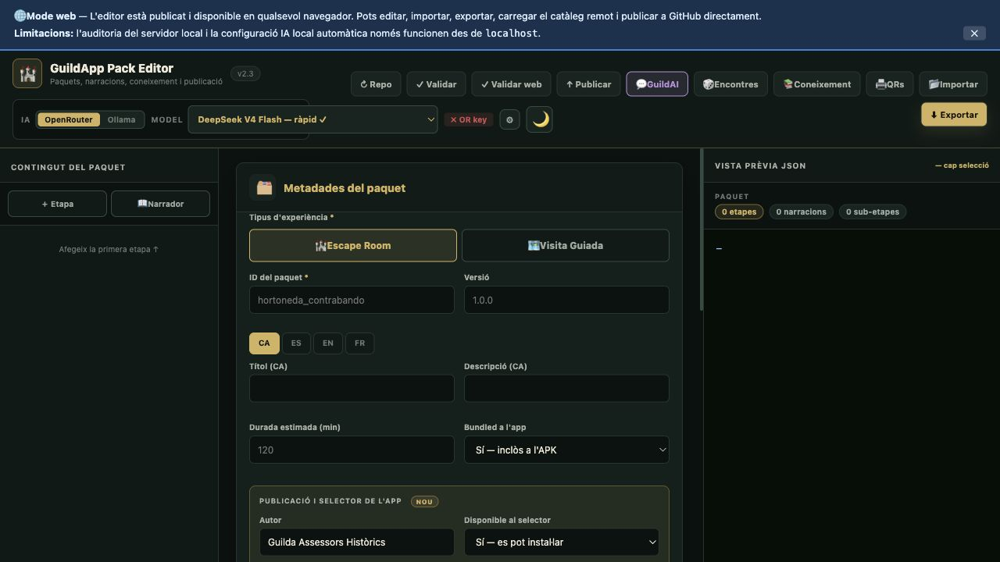
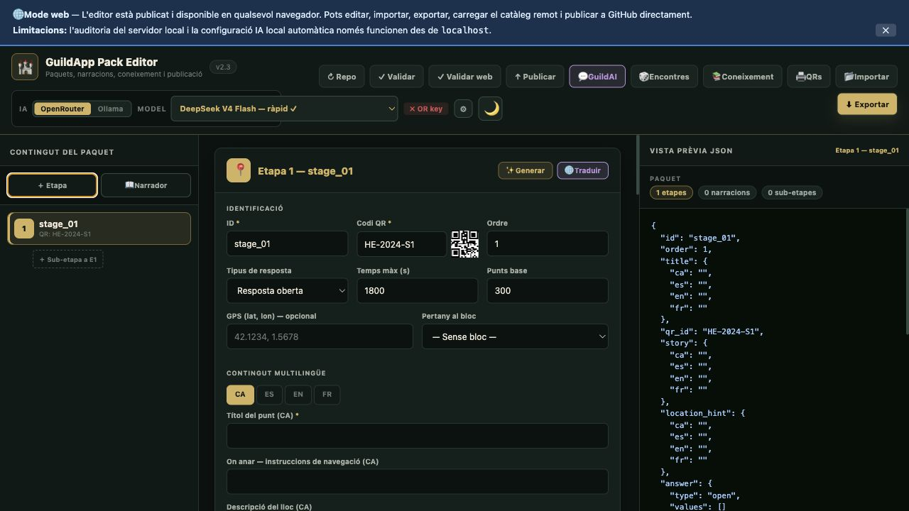
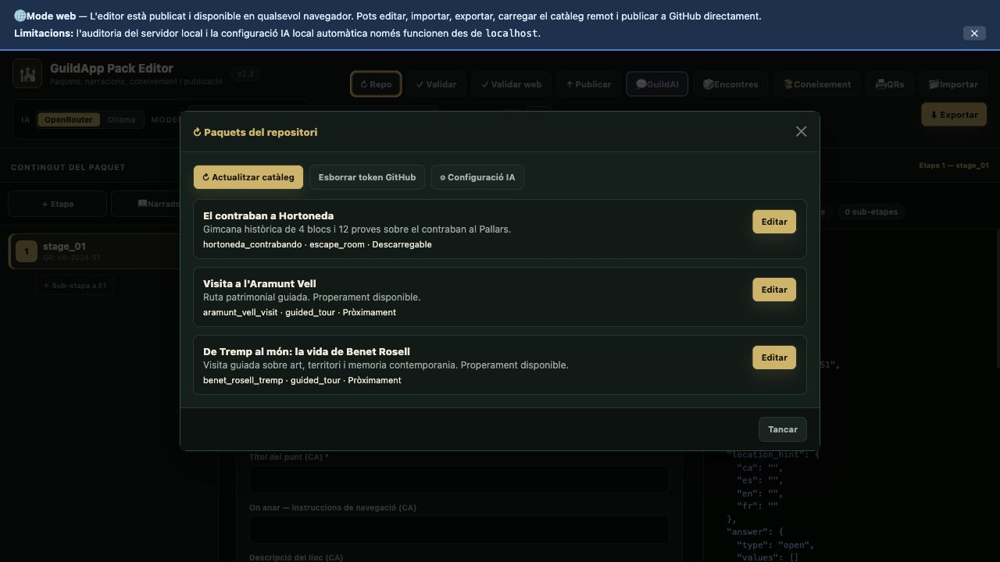
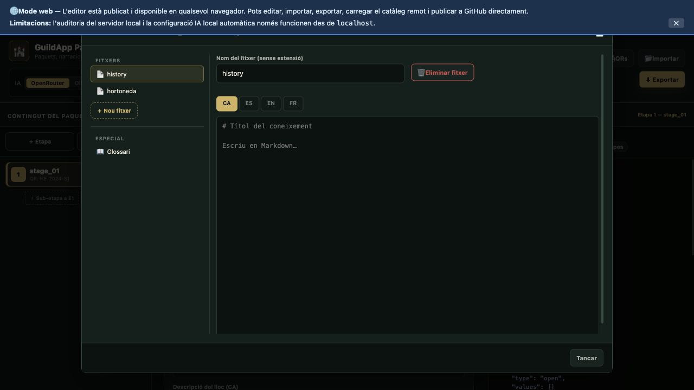

# GuildApp Pack Editor

Editor web per crear, editar, validar, exportar i publicar paquets de contingut de GuildApp.

Web publicada:

- [https://lofonollscp-creator.github.io/guildapp-pack-editor/](https://lofonollscp-creator.github.io/guildapp-pack-editor/)

## Resum ràpid

Amb aquest editor pots:

- crear paquets nous d'`Escape Room` o `Visita Guiada`;
- editar paquets existents;
- importar i exportar el JSON complet del paquet;
- preparar paquets per al selector `Selecciona Aventura`;
- publicar paquets remots a `guildapp-content`;
- definir etapes, narracions, blocs, coneixement i metadades;
- generar, traduir o revisar contingut amb IA;
- generar QRs i material auxiliar.

## Captures

### Vista general



### Edició d'una etapa



### Configuració d'IA


### Catàleg remot i repositori



### Base de coneixement



## Índex

- [Resum ràpid](#resum-ràpid)
- [Captures](#captures)
- [Mode web i mode localhost](#mode-web-i-mode-localhost)
- [Mapa de la interfície](#mapa-de-la-interfície)
- [Barra superior](#barra-superior)
- [Sidebar esquerra](#sidebar-esquerra)
- [Editor central](#editor-central)
- [Vista prèvia JSON](#vista-prèvia-json)
- [Finestres i menús](#finestres-i-menús)
- [Compatibilitat funcional](#compatibilitat-funcional)
- [Fluxos recomanats](#fluxos-recomanats)
- [Dreceres](#dreceres)
- [Persistència local](#persistència-local)
- [Publicació a GitHub](#publicació-a-github)
- [Troubleshooting](#troubleshooting)
- [Manteniment del lloc web](#manteniment-del-lloc-web)

## Mode web i mode localhost

### Què funciona bé a la web publicada

- edició completa del paquet;
- càrrega del catàleg remot;
- importació i exportació;
- publicació a GitHub amb token;
- validació en navegador;
- configuració d'OpenRouter i perfils Ollama;
- ús de GuildAI.

### Limitacions del mode web

- no existeix el proxy local `/__ollama_proxy`;
- no existeix l'endpoint `/__validate_pack`;
- no llegeix `local_ai_config.json` local;
- les proves d'Ollama Cloud poden fallar per CORS si el navegador bloqueja la crida directa.

### Quan convé obrir-lo en localhost

Usa el mode local si vols:

- auditoria amb suport del servidor local;
- configuració automàtica de claus locals;
- treballar amb el proxy local per a Ollama Cloud.

Ordre habitual:

```bash
python3 editor/guildapp_editor_server.py
```

## Mapa de la interfície

La pantalla es divideix en 4 zones:

1. barra superior;
2. sidebar esquerra amb el contingut del paquet;
3. panell central d'edició;
4. columna dreta amb la previsualització JSON.

## Barra superior

### Marca i capçalera

- `GuildApp Pack Editor`
- versió visible del fitxer

### Bloc IA

Inclou:

- selector de proveïdor:
  - `OpenRouter`
  - `Ollama`
- selector de model d'OpenRouter;
- indicador d'estat IA;
- botó `⚙ Configuració IA`;
- botó de canvi de tema dia/nit.

### Accions principals

| Botó | Funció |
|---|---|
| `↻ Repo` | Obre el catàleg remot de paquets |
| `✓ Validar` | Fa la validació estructural en navegador |
| `🛡 Auditar` | En web fa validació web; en `localhost` afegeix comprovacions del servidor local |
| `↑ Publicar` | Prepara i executa la publicació a GitHub |
| `💬 GuildAI` | Obre el xat d’ajuda per crear o modificar el pack |
| `🎲 Encontres` | Obre l’editor d’encontres aleatoris |
| `📚 Coneixement` | Obre la base de coneixement per a La Padrina |
| `🖨 QRs` | Genera i imprimeix els codis QR de les etapes |
| `📂 Importar` | Importa un paquet enganxant JSON |
| `⬇ Exportar` | Exporta el paquet complet |

## Sidebar esquerra

La sidebar mostra `Contingut del paquet`.

Botons principals:

- `＋ Etapa`: crea una etapa nova;
- `📖 Narrador`: crea una narració nova.

La llista de la sidebar mostra:

- etapes;
- narracions;
- sub-etapes associades;
- ordre actual del contingut.

## Editor central

El panell central canvia segons l’element seleccionat.

### 1. Metadades del paquet

Aquest bloc sempre és visible i defineix la capçalera funcional del paquet.

#### Tipus d’experiència

- `🏰 Escape Room`
- `🗺 Visita Guiada`

El tipus de paquet activa o amaga parts de l’editor.

#### Camps bàsics

- `ID del paquet`
- `Versió`
- `Títol` en `CA / ES / EN / FR`
- `Descripció` en `CA / ES / EN / FR`
- `Durada estimada (min)`
- `Bundled a l'app`
  - `Sí — inclòs a l'APK`
  - `No — fitxer extern`

#### Publicació i selector de l’app

Serveix per controlar com apareix el paquet a `Selecciona Aventura`.

Camps:

- `Autor`
- `Disponible al selector`
  - `Sí — es pot instal·lar`
  - `No — mostrar com pròximament`
- `URL base de descàrrega`
- `Etiqueta d'estat` en `CA / ES / EN / FR`

Ús habitual:

- si el paquet és descarregable, `Disponible al selector = Sí`;
- si encara no està llest, `Disponible al selector = No` i s’omple `Pròximament`.

#### Puntuació

Només per `Escape Room`.

Camps:

- `Puntuació inicial`
- `Penalització per saltar etapa`
- `Penalització per pista avançada`
- `Penalització per resposta incorrecta`

#### Blocs del paquet

Només per `Escape Room`.

Els blocs agrupen etapes per al hub d’activitats.

Funcions:

- `＋ Afegir bloc`
- editar bloc existent
- ordenar blocs

Cada bloc té:

- `ID`
- `Ordre`
- `Icona`
- `Títol` multilingüe
- `Descripció` multilingüe
- `Pista per trobar el QR del següent bloc`

### 2. Panell d’etapa

S’obre quan selecciones una etapa.

Botons del capçal:

- `✨ Generar`
- `🌐 Traduir`

#### Identificació

- `ID`
- `Codi QR`
- `Ordre`
- `Tipus de resposta`
  - `Resposta oberta`
  - `Text exacte`
  - `Número`
  - `Paraula clau`
  - `Foto`
  - `Visita guiada`
- `Temps màx (s)`
- `Punts base`
- `GPS (lat, lon)`
- `Pertany al bloc` en mode `Escape Room`

#### Contingut multilingüe

Per idiomes `CA / ES / EN / FR`:

- `Títol del punt`
- `On anar / instruccions`
- `Descripció del lloc`
- `Nota educativa` on toca

#### Respostes correctes

Permet:

- afegir múltiples respostes;
- definir alternatives vàlides.

#### Pistes

- llista ordenada de pistes;
- diverses pistes escalades per etapa.

#### Verificació IA La Padrina / El Meco

Per a respostes obertes o validacions semàntiques.

Camps:

- criteri principal de validació;
- `Keywords de validació`;
- `Longitud mínima`;
- `Requereix número`.

#### Regles IA anti-spoiler

Botons:

- `⚙ Generar guardrails`
- `🧪 Simular guardrails`

Camps:

- `Temes permesos`
- `Nivell màxim de pista`
- `Mode estricte`
- `No revelar coordenades`
- `Respostes/fragments prohibits`
- `Keywords internes de solució`
- `Alias de resposta`
- `Frases spoiler`
- `Ubicacions sensibles`

#### Funcions avançades de la app

- `Pista de camp anti-bloqueig`
- `Prompt de foto`
- `Rals atorgats`
- `Item atorgat`
- `Rol requerit`
- `Items requerits`
- `Frase AR / aparició`

#### Imatges de contingut

Permet:

- pujar una o diverses imatges;
- mantenir-les associades a l’etapa.

#### Sub-etapes d’aquest punt

Les sub-etapes es guarden com a autoría i edició futura.

Botó:

- `＋ Nova sub-etapa`

#### Accions d’etapa

- `🗑 Eliminar`
- `📋 Duplicar`
- `↑ Pujar`
- `↓ Baixar`

### 3. Panell de sub-etapa

S’obre quan selecciones una sub-etapa.

Compatibilitat actual:

- es conserva al paquet exportat/publicat;
- la app actual no l’executa com a flux nadiu independent.

Inclou:

- `ID`
- `Ordre dins l'etapa`
- `Punts`
- `Tipus de resposta`
- `Temps màx (s)`
- `Títol / context / pista` en 4 idiomes
- `Respostes correctes`
- `Pistes`

Accions:

- `🗑 Eliminar`
- `↑`
- `↓`
- `← Tornar a l'etapa`

### 4. Panell de narració

S’obre quan selecciones una narració.

Compatibilitat actual:

- `before_stage` i `after_stage` encaixen amb la lògica de la app;
- `standalone` es conserva sobretot com a material d’autoría.

Botons del capçal:

- `✨ Generar`
- `🌐 Traduir`

Camps:

- `ID`
- `Moment d'aparició`
  - `Autònom (QR o GPS)`
  - `Abans d'una etapa`
  - `Després d'una etapa`
  - `En entrar a la zona`
- `Etapa de referència`
- `Fitxer àudio`
- `Text` en `CA / ES / EN / FR`

Accions:

- `🗑 Eliminar`
- `↑ Pujar`
- `↓ Baixar`

## Vista prèvia JSON

La columna dreta mostra en temps real:

- recompte d’etapes;
- recompte de narracions;
- recompte de sub-etapes;
- JSON complet del paquet tal com s’exportarà.

Serveix per:

- entendre l’estructura final;
- detectar errors de dades;
- copiar o inspeccionar el resultat abans de publicar.

## Finestres i menús

### `Repo`

Mostra els paquets del catàleg remot.

Funcions:

- `↻ Actualitzar catàleg`
- `Esborrar token GitHub`
- `⚙ Configuració IA`
- llistar paquets publicats;
- carregar un paquet remot existent per editar-lo.

Cada targeta pot mostrar:

- títol;
- descripció;
- `id`;
- tipus;
- estat: `Bundle`, `Descarregable`, `Pròximament`.

### `Validar`

Fa la validació estructural del paquet.

Comprova, entre altres coses:

- camps obligatoris;
- localitzacions mínimes;
- coherència d’etapes i narracions;
- fitxers de coneixement;
- paquets remots i etiquetes d’estat;
- fitxers necessaris per a publicació.

Sortida:

- nombre d’errors;
- nombre d’avisos;
- detall per incidència.

### `Auditar`

Comportament segons entorn:

- en web pública: fa validació web;
- en `localhost`: afegeix auditoria del servidor local.

### `Exportar`

Opcions:

- `📋 Copiar`
- `⬇ Descarregar .json`
- `⬇ Entrada manifest`

Serveix per obtenir:

- el bundle complet;
- l’entrada de catàleg/manifest.

### `Importar JSON`

Flux:

1. obres `📂 Importar`;
2. enganxes el JSON;
3. prems `Importar`.

### `Publicar`

Flux de publicació:

1. valida i audita;
2. comprova si el paquet és extern i no bundlejat;
3. prepara la previsualització de fitxers;
4. mostra el resum de publicació;
5. `Confirmar i publicar`.

Requisits:

- token GitHub amb permís `Contents: Read and write`;
- paquet remot ben format;
- metadades coherents si ha de sortir al selector.

### `Configuració IA`

Té dues pestanyes.

#### `OpenRouter`

Funcions:

- afegir una o més claus;
- marcar clau activa;
- tenir claus de respaldo;
- guardar-ho a `localStorage`.

#### `Ollama`

Funcions:

- afegir perfils;
- definir:
  - `Etiqueta`
  - `Model`
  - `Endpoint`
  - `Format de l'API`
  - `Clau API`
- provar la connexió activa.

Formats suportats:

- `OpenAI Compatible (/v1/chat/completions)`
- `Ollama Natiu (/api/chat)`

### `GuildAI`

És el xat d’assistència per construir el paquet amb IA.

Funcions:

- conversa lliure sobre el pack;
- suggeriments de noves etapes, textos o modificacions;
- `📦 Estat` per injectar l’estat actual del paquet al prompt;
- generació d’accions proposades;
- aplicació d’accions:
  - individualment;
  - `Aplicar totes`.

Botons:

- `🔄 Nou`
- `📦 Estat`
- `Envia`
- `Aplicar totes` quan hi ha canvis pendents

### `Encontres`

Editor d’encontres aleatoris d’autoría.

Compatibilitat actual:

- es desen al paquet/editor;
- la runtime actual encara pot mantenir la seva implementació interna.

Funcions:

- crear `＋ Nou encontre`;
- editar:
  - `ID`
  - `Rals (+/-)`
  - `Icona`
  - text en `CA / ES / EN / FR`;
- `🌐 Traduir amb IA`;
- `⬇ Exportar Dart`;
- `📂 Importar JSON`;
- eliminar l’encontre seleccionat.

Subfinestres:

- `Exportar encontres`
  - copiar Dart
  - descarregar snippet `.dart`
  - copiar JSON
- `Importar encontres (JSON)`

### `QRs`

Genera els codis QR físics de les etapes.

Funcions:

- veure totes les targetes QR;
- `🖨 Imprimir`;
- `⬇ Descarregar tots (.png)`.

Cada targeta pot incloure:

- número d’etapa;
- títol;
- QR;
- pista de localització;
- instruccions d’escaneig.

### `Coneixement`

És la base de coneixement usada per La Padrina.

Té dues parts.

#### Fitxers Markdown

Funcions:

- `＋ Nou fitxer`
- renombrar fitxer;
- editar contingut per idiomes;
- eliminar fitxer.

Cada fitxer:

- es guarda per nom lògic;
- pot tenir contingut `CA / ES / EN / FR`.

#### Glossari

Funcions:

- definir termes clau;
- donar traduccions per idiomes;
- reforçar el context de la IA.

### `Editar Bloc`

Permet editar un bloc del paquet.

Camps:

- `ID del bloc`
- `Ordre`
- `Icona`
- `Títol` en 4 idiomes
- `Descripció` en 4 idiomes
- `Pista per trobar el QR del següent bloc`

Accions:

- `💾 Desar`
- `Cancel·lar`

## Compatibilitat funcional

### Natiu o gairebé natiu

- metadades del paquet;
- etapes;
- validacions;
- selector remot;
- QRs;
- publicació remota;
- base de coneixement;
- guardrails IA.

### Conservat per autoría o parcial

- sub-etapes;
- narracions `standalone`;
- encontres aleatoris mentre no es connectin del tot a runtime.

## Fluxos recomanats

### Crear un paquet nou

1. defineix tipus de paquet;
2. omple metadades;
3. crea etapes;
4. afegeix validacions, pistes i guardrails;
5. passa `Validar`;
6. exporta o publica.

### Publicar un paquet descarregable

1. marca `Bundled a l'app = No`;
2. posa `Disponible al selector = Sí`;
3. revisa `URL base de descàrrega`;
4. valida;
5. publica a GitHub.

### Publicar un paquet com `Pròximament`

1. posa `Disponible al selector = No`;
2. omple `Etiqueta d'estat` en idiomes;
3. desa o publica el catàleg corresponent.

## Dreceres

- `Cmd+Enter` / `Ctrl+Enter`: enviar missatge a GuildAI.
- `Cmd+E` / `Ctrl+E`: obrir exportació.

## Persistència local

L’editor guarda estat local de:

- configuració IA;
- esborranys;
- part del material d’autoría.

## Publicació a GitHub

Necessites un token amb:

- `Contents: Read and write`

S’usa per:

- pujar paquets nous;
- actualitzar paquets existents;
- carregar el catàleg remot i preparar publicació.

## Troubleshooting

### Ollama Cloud no funciona a la web

Símptomes habituals:

- error de CORS;
- `Load failed`;
- proves de connexió fallides des del navegador.

Causa habitual:

- la web pública no té proxy local;
- alguns endpoints d’Ollama Cloud no permeten la crida directa des del navegador.

Què fer:

- prova primer amb `OpenRouter`;
- si necessites Ollama Cloud, obre l’editor en `localhost`;
- si uses una instància pròpia, revisa que l’endpoint sigui correcte i accessible.

### La publicació a GitHub falla

Comprovacions bàsiques:

- el token ha de tenir `Contents: Read and write`;
- el paquet ha de ser extern si l’has de publicar remotament;
- l’`ID del paquet` ha de ser vàlid i estable;
- la validació no ha de tenir errors bloquejants.

Revisa especialment:

- `Bundled a l'app = No` si el paquet ha de viure fora de l’APK;
- `Disponible al selector` coherent amb l’estat real del paquet;
- `URL base de descàrrega` si l’has de definir manualment.

### El paquet no surt bé a `Selecciona Aventura`

Símptomes habituals:

- no apareix;
- surt sense descripció;
- surt instal·lable quan havia de dir `Pròximament`;
- surt com `Pròximament` quan ja hauria de ser descarregable.

Comprovacions:

- `Autor`, `Títol` i `Descripció` han d’estar omplerts;
- `Disponible al selector = Sí` per a paquets instal·lables;
- `Disponible al selector = No` per a paquets en espera;
- `Etiqueta d'estat` omplerta si el paquet és `Pròximament`;
- `URL base de descàrrega` i fitxers remots correctes si el paquet es descarrega.

### El paquet marca `Pròximament` però no es veu bé

Configuració recomanada:

- `Disponible al selector = No`;
- `Etiqueta d'estat` omplerta en `CA / ES / EN / FR`;
- paquet coherent encara que no tingui tot el contingut final.

Si no omples l’etiqueta, el validador et donarà avisos o errors segons el cas.

### `Validar` o `Auditar` donen avisos que no entens

Diferència:

- `Validar` comprova l’estructura i coherència del paquet;
- `Auditar` en web fa pràcticament el mateix;
- `Auditar` en `localhost` pot afegir comprovacions extra del servidor local.

Ordre recomanat:

1. resol tots els errors;
2. revisa després els avisos;
3. si el paquet és remot, para especial atenció a:
   - selector;
   - disponibilitat;
   - fitxers necessaris;
   - etiquetes d’estat.

### El catàleg remot no carrega

Símptomes habituals:

- la finestra `Repo` es queda buida;
- error en carregar `catalog.json`;
- paquets nous no apareixen.

Què revisar:

- connexió a internet;
- que `guildapp-content` tingui un `catalog.json` vàlid;
- que el paquet nou estigui realment afegit al catàleg;
- que no hi hagi cache temporal del navegador.

Accions útils:

- prem `↻ Actualitzar catàleg`;
- recarrega la pàgina;
- torna a provar al cap d’uns segons si acabes de fer push.

### El JSON s’importa però l’editor no queda bé

Causes habituals:

- JSON incomplet;
- camps antics o amb noms que ja no toquen;
- paquets d’autoría amb estructures parcials.

Què fer:

- importa el JSON;
- passa `Validar`;
- corregeix camps obligatoris des de l’editor;
- torna a exportar per deixar-lo normalitzat.

### GuildAI no proposa canvis útils

Per millorar el resultat:

- descriu el que vols de forma concreta;
- indica si és `Escape Room` o `Visita Guiada`;
- especifica nombre d’etapes, to i dificultat;
- usa `📦 Estat` per donar context del paquet actual;
- revisa les accions proposades abans d’aplicar-les.

### Els QRs no serveixen o no coincideixen

Revisa:

- que cada etapa tingui `Codi QR`;
- que no hi hagi codis duplicats;
- que l’ordre i les pistes siguin coherents;
- que no hagis canviat IDs o codis després d’imprimir.

Recomanació:

- genera els QRs al final del procés d’edició.

### Una narració o sub-etapa no es comporta com esperaves a la app

Compatibilitat real:

- les sub-etapes es conserven com a autoría, però no són flux nadiu complet;
- les narracions `before_stage` i `after_stage` són les més alineades amb la runtime;
- les narracions `standalone` poden quedar com a material editorial o futur.

Si busques compatibilitat màxima amb la app actual:

- prioritza etapes normals;
- usa narracions associades a etapa;
- tracta sub-etapes i materials auxiliars com a capa d’autoría.

## Manteniment del lloc web

Aquest repo es publica amb GitHub Pages.

Canvis habituals que afecten la web:

- `index.html`
- `README.md`
- `local_ai_config.example.json`
- `.github/workflows/deploy-pages.yml`

Qualsevol d’aquests canvis es pot tornar a desplegar amb el workflow del repo.
